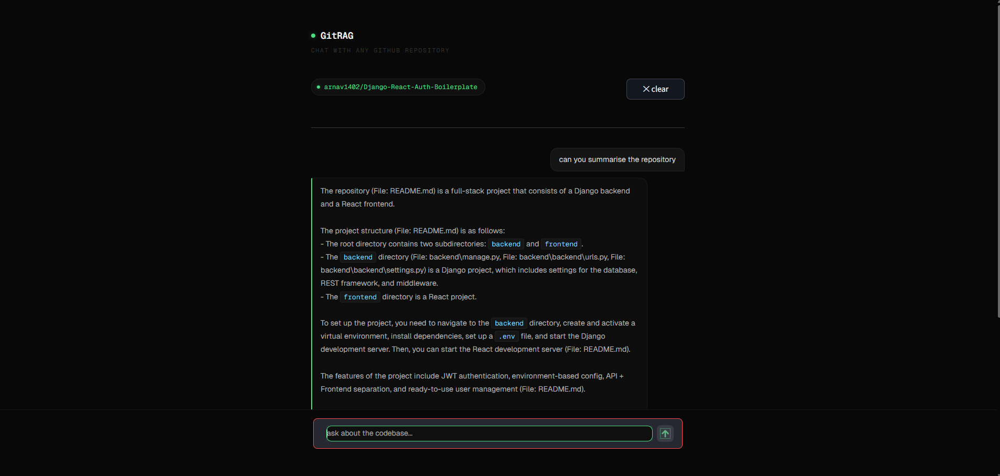
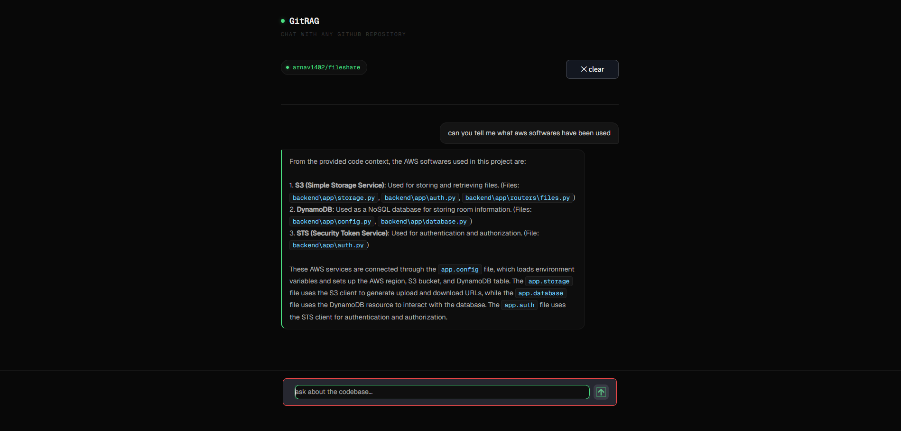
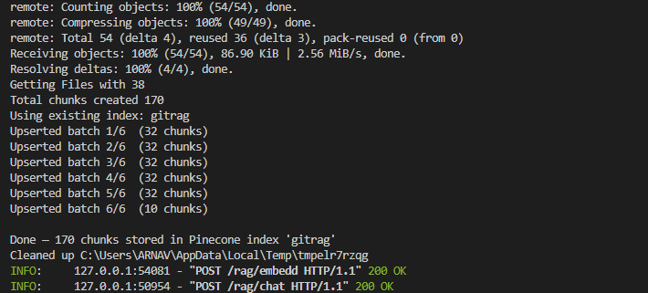

# GitHub RAG (Retrieval-Augmented Generation)

### Query using GROQ on Pinecode vector DB



### Query using GROQ on Pinecode vector DB



### Server Logs for Vector Embeddings



---

## Overview

GitHub RAG is a retrieval-augmented generation system that allows users to query any GitHub repository using natural language.  
It processes repository files, generates embeddings, stores them in a vector database, and retrieves relevant context to answer queries using an LLM.

---

## Core Features

- Query GitHub repos in natural language
- Automatic repo cloning & file parsing
- Context-aware answers using RAG pipeline
- Fast retrieval using vector search (Pinecone)
- LLM-powered responses (Groq / OpenAI)
- Interactive UI with Streamlit

---

## Tech Stack

- **Python** — Core backend
- **SentenceTransformers** — Embeddings
- **Pinecone** — Vector database
- **Groq / OpenAI** — LLM inference
- **FastAPI** — Backend API
- **Streamlit** — Frontend UI

---

## Setup & Installation

### 1. Clone the Repository

```bash
git clone https://github.com/arnav1402/Github_Rag.git
cd Github_Rag
```

---

### 2️. Create Virtual Environment

```bash
python -m venv .venv
```

Activate:

**Windows**

```bash
.venv\Scripts\activate
```

**Mac/Linux**

```bash
source .venv/bin/activate
```

---

### 3. Install Dependencies

```bash
pip install -r requirements.txt
```

---

### 4️. Configure Environment Variables

```bash
cp .example_env .env
```

Update `.env`:

```env
PINECONE_API_KEY=your_key
GROQ_API_KEY=your_key
```

---

## Run the Project

### Start Backend (FastAPI)

```bash
uvicorn api:app --reload
```

---

### Start Frontend (Streamlit)

```bash
streamlit run app.py
```

---

## Usage

1. Enter a GitHub repository URL
2. System indexes the repo
3. Ask questions about the codebase
4. Get context-aware answers with file references

---

## Notes

- First run will download embedding model (~400MB)
- Backend must be running before using UI
- Designed for local development (deployment WIP)
